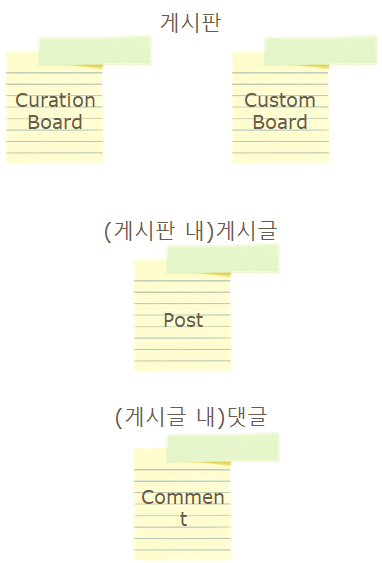
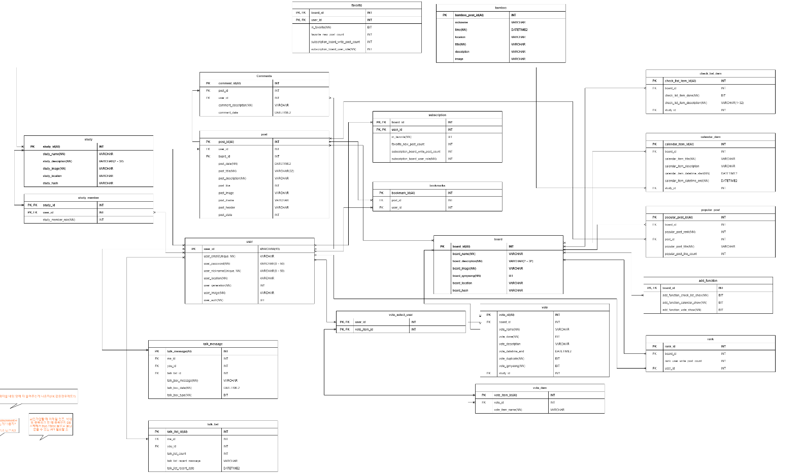
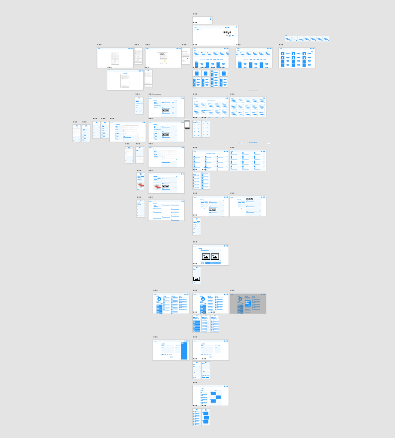
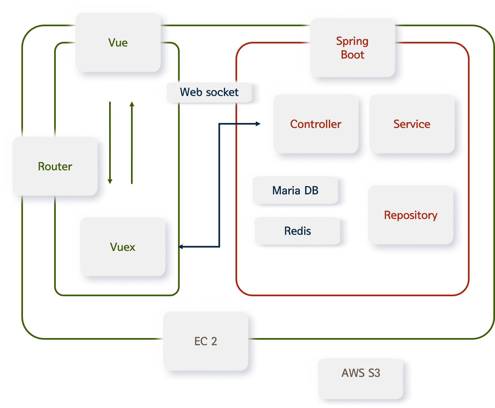
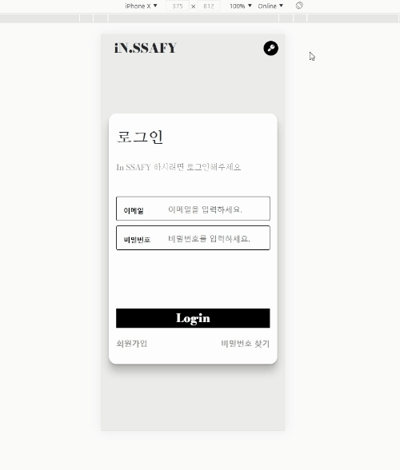
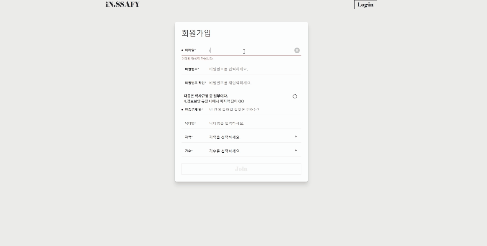
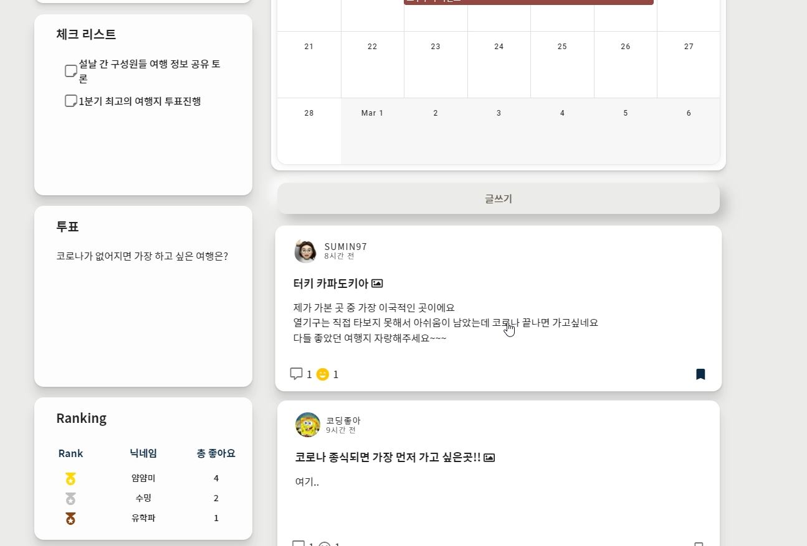
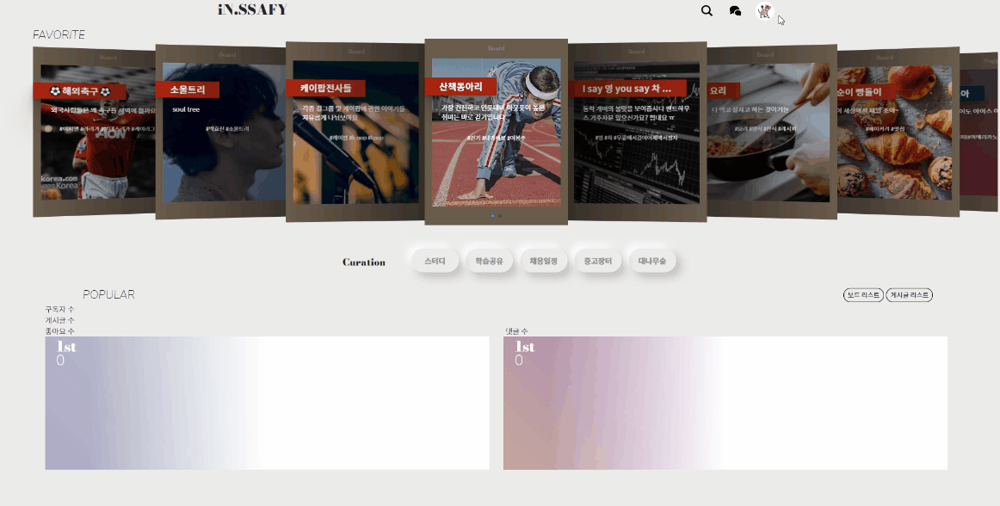
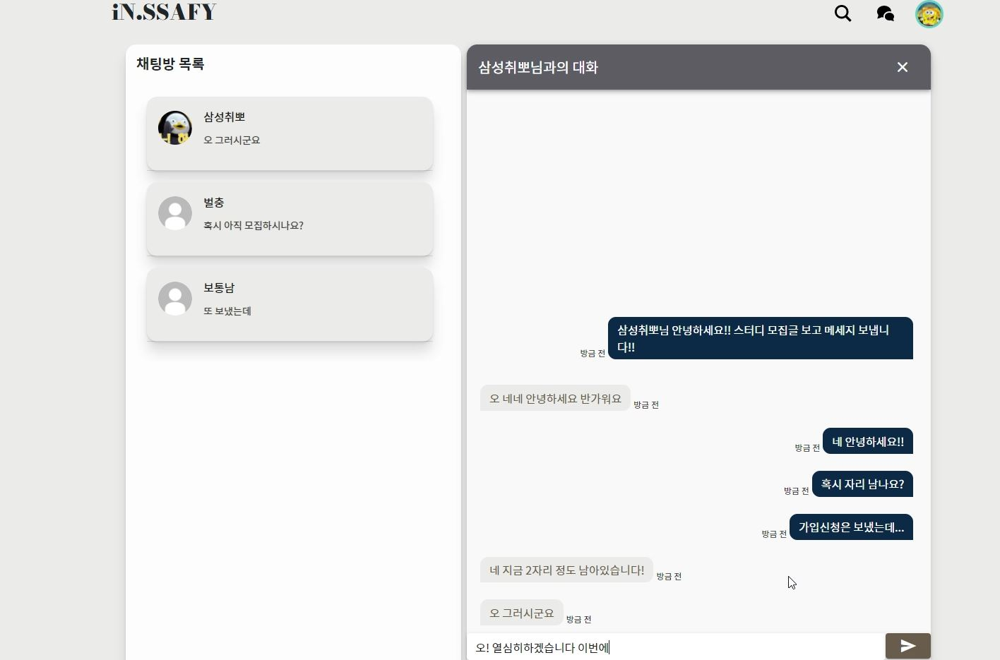

## InSSAFY

>  **삼성 청년 SW 아카데미 교육생들을 위한 커뮤니티**
>
>  프로젝트 기간: 21.01.11 ~ 21.02.19(6주)

[소개 동영상 보러 가기](https://www.youtube.com/watch?v=8hFrkriWEDc)

 

### 목차

[팀원 소개](#팀원-소개)

[서비스 소개](#InSSAFY는)

[관련 문서](#관련-문서)

- 기능 명세서
- API 설계
- 와이어 프레임
- 소개 자료
- 시스템 아키텍쳐
- 서비스 플로우
- AI 모델 소개

[기능 소개](#주요-기능-화면-예시)

 

### 팀원 소개

| 이름         | 역할                               | 프로필                                   |
| ------------ | ---------------------------------- | ---------------------------------------- |
| 배용렬(팀장) | 프론트 엔드 책임 개발자, 영상 제작 | [github](https://github.com/YRBae)       |
| 문진환       | 백엔드 개발자                      | [github](https://github.com/moonjinhwan) |
| 윤수민       | 백엔드 개발자                      | [github](https://github.com/sumin2791)   |
| 최규수       | 프론트 엔드 개발자                 | [github](https://github.com/qsoo)        |
| 황승주       | 프론트 엔드 개발자, 영상 제작      | [github](https://github.com/wealways)    |

 

### InSSAFY는

인싸피는 **싸피인(삼성 청년 SW 아카데미 수강생)들을 위한 SNS 커뮤니티**입니다. 

SNS 커뮤니티는 사용자가 많기 때문에 SPA을 이용해서 성능을 향상시키고자 했습니다. 

그래서 SPA를 지원하는 앵귤러, 리액트, 뷰 중에서 4주간의 실 개발 기간을 고려해 가독성이 높고 직관적인 뷰를 선택했습니다.

- 사용자는 회원 가입을 할 때 SSAFY 교육생인지 확인하는 절차를 거친 뒤 회원 가입 가능
- 중고장터, 스터디, 학습 공유, 대나무숲, 채용일정 등은 서비스 제공자 측에서 기본적으로 제공하는 게시판
- 추가적으로 사용자가 만들 수 있는 게시판은 추가 기능 선택하여 생성 가능
  - 투표
  - 캘린더
  - 체크 리스트
  - 인기글
  - 랭킹
- 게시판을 활용하면서 사용자들 간의 소통이 필요한 부분을 지원하기 위해 실시간 채팅 기능 추가

게시판 구성 모습

 

### 관련 문서

| 문서 명                                                      | 내용                                                         | 비고                                     |
| ------------------------------------------------------------ | ------------------------------------------------------------ | ---------------------------------------- |
| [기능명세서](https://docs.google.com/spreadsheets/d/1c8vtOIx0Vuldx85c84Zsc0akzTIEym5nZ288E4hRMuA/edit?usp=sharing) | 설계 단계에서 사용한 기능명세서 내용 Jira 분류 이용(epic - story - subtask) | 핵심 구현 기능과 선택 구현 기능으로 분류 |
| [와이어 프레임](./assets/wireframe.xd)                       | 와이어 프레임 설계(Adobe XD)                                 | `.xd` file                               |
| [소개 자료](./assets/소개자료.pdf)                           | 기획 배경 및 서비스 소개 자료                                |                                          |

### ERD

 

### 와이어 프레임 예시

 

### 시스템 아키텍쳐

 

### 주요 기능 화면 예시

#### 모바일 화면 예시

반응형으로 제작하여 PC/모바일 환경 지원

 

#### 메인 페이지

즐겨찾기 게시판과 게시판 인기순 정렬

 

#### 회원가입

이메일 인증 및 퀴즈 정답을 통한 싸피인 인증

 

#### 커스텀 게시판

사용자가 직접 생성하여 이용할 수 있는 게시판

해당 게시판에서는 추가 기능을 추가하여 이용할 수 있음

 

#### 마이 페이지

사용자들이 자신의 활동과 정보를 변경할 수 있는 페이지

구독 중인 게시판, 작성글/댓글, 스크랩한 글 등을 조회할 수 있으며 비밀번호 변경 등 내 정보 변경 가능

 

#### 실시간 채팅

 

